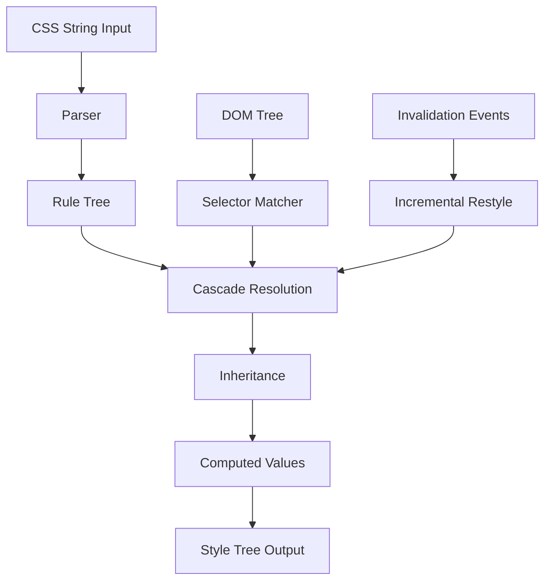

# CSS Engine Component Specification
## CortenBrowser Project - Component Version 1.0

---

## 1. Component Overview

### Purpose and Responsibilities
The CSS Engine is responsible for parsing CSS stylesheets, computing styles for DOM elements, and producing a style tree that can be consumed by the rendering engine. It handles cascade resolution, inheritance, selector matching, and computed value calculation according to CSS specifications.

### Current Implementation
- **Base**: Servo's style system (stylo)
- **Language**: Rust
- **Key Libraries**: 
  - `selectors` - CSS selector matching
  - `cssparser` - CSS parsing
  - `style` - Servo's style engine

### Target Implementation Goals
- Full CSS3 support with partial CSS4 features
- Performance within 1.5x of Chrome's Blink CSS engine
- Memory efficiency through aggressive style sharing
- Support for CSS custom properties (CSS Variables)
- CSS Grid, Flexbox, and Container Queries
- CSS Houdini API preparation (future enhancement)
- 85% pass rate on WPT CSS tests

### Component Statistics
- **Estimated Lines of Code**: 100,000-150,000
- **Development Time**: 12-16 weeks (with existing Servo base)
- **Memory Budget**: <500MB for typical web page
- **Performance Target**: <50ms style calculation for 10,000 elements

---

## 2. Interface Specification

### Public API Definition

```rust
use browser_types::{DomNode, Url, StyleSheet, ComputedStyle};
use browser_interfaces::BrowserComponent;

/// Main CSS Engine interface
pub trait CssEngine: BrowserComponent {
    /// Parse a CSS stylesheet from string
    fn parse_stylesheet(&mut self, css: &str, source_url: Option<&Url>) 
        -> Result<StyleSheetId, CssError>;
    
    /// Add an inline style to an element
    fn set_inline_style(&mut self, element_id: ElementId, style: &str) 
        -> Result<(), CssError>;
    
    /// Compute styles for a DOM tree
    fn compute_styles(&mut self, dom_root: &DomNode) 
        -> Result<StyleTree, CssError>;
    
    /// Get computed style for specific element
    fn get_computed_style(&self, element_id: ElementId) 
        -> Result<ComputedStyle, CssError>;
    
    /// Invalidate styles for incremental recomputation
    fn invalidate_styles(&mut self, invalidation: StyleInvalidation) 
        -> Result<(), CssError>;
    
    /// Hot-reload stylesheet (for DevTools)
    fn update_stylesheet(&mut self, id: StyleSheetId, new_css: &str) 
        -> Result<(), CssError>;
    
    /// Media query evaluation
    fn evaluate_media_queries(&mut self, viewport: ViewportInfo) 
        -> Result<MediaQueryResult, CssError>;
    
    /// Animation and transition management
    fn tick_animations(&mut self, timestamp: f64) 
        -> Result<AnimationUpdates, CssError>;
}

/// Style tree produced by the CSS engine
#[derive(Debug, Clone)]
pub struct StyleTree {
    pub root: StyleNode,
    pub keyframes: HashMap<String, Keyframes>,
    pub font_faces: Vec<FontFace>,
    pub viewport_rules: Option<ViewportRule>,
    pub page_rules: Vec<PageRule>,
}

/// Individual styled node
#[derive(Debug, Clone)]
pub struct StyleNode {
    pub element_id: ElementId,
    pub computed_style: ComputedStyle,
    pub children: Vec<StyleNode>,
    pub pseudo_elements: HashMap<PseudoElement, Box<StyleNode>>,
}

/// Style invalidation types for incremental recomputation
#[derive(Debug)]
pub enum StyleInvalidation {
    /// Element attribute changed
    AttributeChange { element_id: ElementId, attr: String },
    /// Element class list changed
    ClassChange { element_id: ElementId, added: Vec<String>, removed: Vec<String> },
    /// Element was inserted
    ElementInserted { element_id: ElementId, parent_id: ElementId },
    /// Element was removed
    ElementRemoved { element_id: ElementId },
    /// Pseudo-class state changed (:hover, :focus, etc.)
    StateChange { element_id: ElementId, state: ElementState },
    /// Viewport changed (for media queries)
    ViewportChange { viewport: ViewportInfo },
}
```

### Message Types Handled

```rust
use browser_messages::{ComponentMessage, ComponentResponse};

impl MessageHandler for CssEngineImpl {
    fn handle_message(&mut self, msg: ComponentMessage) -> Result<ComponentResponse, Error> {
        match msg {
            ComponentMessage::ParseStylesheet { content, base_url } => {
                let id = self.parse_stylesheet(&content, base_url.as_ref())?;
                Ok(ComponentResponse::StylesheetParsed { id })
            }
            
            ComponentMessage::ComputeStyles { dom_tree } => {
                let style_tree = self.compute_styles(&dom_tree)?;
                Ok(ComponentResponse::StylesComputed { style_tree })
            }
            
            ComponentMessage::InvalidateStyles { invalidation } => {
                self.invalidate_styles(invalidation)?;
                Ok(ComponentResponse::StylesInvalidated)
            }
            
            ComponentMessage::MediaQueryChange { viewport } => {
                let result = self.evaluate_media_queries(viewport)?;
                Ok(ComponentResponse::MediaQueriesEvaluated { result })
            }
            
            ComponentMessage::AnimationTick { timestamp } => {
                let updates = self.tick_animations(timestamp)?;
                Ok(ComponentResponse::AnimationUpdates { updates })
            }
            
            _ => Ok(ComponentResponse::NotHandled)
        }
    }
}
```

### Events Emitted

```rust
/// Events emitted by the CSS Engine
#[derive(Debug, Clone)]
pub enum CssEngineEvent {
    /// Stylesheet parsing completed
    StylesheetReady { id: StyleSheetId, rule_count: usize },
    
    /// Style computation completed
    StylesComputed { duration_ms: f64, element_count: usize },
    
    /// Animation frame needed
    AnimationFrameRequested { timestamp: f64 },
    
    /// Font required but not loaded
    FontRequired { family: String, weight: FontWeight, style: FontStyle },
    
    /// Custom property (CSS variable) defined
    CustomPropertyDefined { name: String, value: String },
    
    /// Performance warning
    PerformanceWarning { message: String, duration_ms: f64 },
}
```

---

## 3. Internal Architecture

### Module Structure

```
css-engine/
├── src/
│   ├── lib.rs                 # Public API
│   ├── engine.rs              # Main engine implementation
│   ├── parser/
│   │   ├── mod.rs            # Parser module interface
│   │   ├── stylesheet.rs     # Stylesheet parser
│   │   ├── selectors.rs      # Selector parser
│   │   ├── properties.rs     # Property parser
│   │   ├── values.rs         # Value parser
│   │   └── media_queries.rs  # Media query parser
│   ├── cascade/
│   │   ├── mod.rs            # Cascade algorithm
│   │   ├── specificity.rs    # Specificity calculation
│   │   ├── inheritance.rs    # Property inheritance
│   │   └── initial_values.rs # Initial/default values
│   ├── matcher/
│   │   ├── mod.rs            # Selector matching
│   │   ├── simple.rs         # Simple selectors
│   │   ├── compound.rs       # Compound selectors
│   │   ├── complex.rs        # Complex selectors
│   │   └── pseudo.rs         # Pseudo-classes/elements
│   ├── stylist/
│   │   ├── mod.rs            # Style computation
│   │   ├── rule_tree.rs      # Rule tree for sharing
│   │   ├── computed.rs       # Computed values
│   │   └── cache.rs          # Style sharing cache
│   ├── invalidation/
│   │   ├── mod.rs            # Invalidation system
│   │   ├── element.rs        # Element invalidation
│   │   ├── subtree.rs        # Subtree invalidation
│   │   └── bloom.rs          # Bloom filter optimization
│   ├── layout_properties/
│   │   ├── mod.rs            # Layout-specific properties
│   │   ├── box_model.rs      # Box model properties
│   │   ├── flexbox.rs        # Flexbox properties
│   │   ├── grid.rs           # Grid properties
│   │   └── positioning.rs    # Positioning properties
│   ├── animations/
│   │   ├── mod.rs            # Animation system
│   │   ├── keyframes.rs      # Keyframe animations
│   │   ├── transitions.rs    # CSS transitions
│   │   └── timing.rs         # Timing functions
│   ├── custom_properties/
│   │   ├── mod.rs            # CSS variables
│   │   ├── registry.rs       # Custom property registry
│   │   └── substitution.rs   # var() substitution
│   └── tests/
│       ├── unit/             # Unit tests
│       ├── integration/      # Integration tests
│       └── benchmarks/       # Performance benchmarks
```

### Data Flow



### Core Data Structures

```rust
/// Parsed stylesheet representation
pub struct Stylesheet {
    pub rules: Vec<CssRule>,
    pub source_map: Option<SourceMap>,
    pub origin: Origin,
    pub media: MediaList,
}

/// CSS Rule types
pub enum CssRule {
    Style(StyleRule),
    Media(MediaRule),
    Import(ImportRule),
    FontFace(FontFaceRule),
    Keyframes(KeyframesRule),
    Supports(SupportsRule),
    Page(PageRule),
    Namespace(NamespaceRule),
}

/// Style rule (selector + declarations)
pub struct StyleRule {
    pub selectors: SelectorList,
    pub declarations: PropertyDeclarationBlock,
    pub source_location: SourceLocation,
}

/// Selector representation
pub struct Selector {
    pub components: Vec<Component>,
    pub specificity: Specificity,
    pub flags: SelectorFlags,
}

/// Property declaration block
pub struct PropertyDeclarationBlock {
    pub declarations: Vec<PropertyDeclaration>,
    pub important_declarations: Vec<PropertyDeclaration>,
}

/// Computed style values
pub struct ComputedValues {
    // Box model
    pub display: Display,
    pub position: Position,
    pub width: Length,
    pub height: Length,
    pub margin: BoxSides<Length>,
    pub padding: BoxSides<Length>,
    pub border: BoxSides<Border>,
    
    // Text
    pub font_family: Vec<FontFamily>,
    pub font_size: Length,
    pub line_height: LineHeight,
    pub color: Color,
    
    // Flexbox
    pub flex_direction: FlexDirection,
    pub justify_content: JustifyContent,
    pub align_items: AlignItems,
    
    // Grid
    pub grid_template_columns: GridTrackList,
    pub grid_template_rows: GridTrackList,
    
    // And 200+ more properties...
}

/// Rule tree for style sharing
pub struct RuleTree {
    root: RuleNode,
    nodes: Arena<RuleNode>,
    cache: StyleSharingCache,
}

/// Style sharing cache
pub struct StyleSharingCache {
    cache: LruCache<CacheKey, Arc<ComputedValues>>,
    bloom_filter: BloomFilter,
}
```

### State Management

```rust
/// Main CSS Engine state
pub struct CssEngineState {
    /// All loaded stylesheets
    stylesheets: HashMap<StyleSheetId, Stylesheet>,
    
    /// User agent stylesheet (browser defaults)
    user_agent_sheet: Stylesheet,
    
    /// Rule tree for efficient cascade
    rule_tree: RuleTree,
    
    /// Style sharing cache
    sharing_cache: StyleSharingCache,
    
    /// Animation state
    animations: AnimationState,
    
    /// Custom properties registry
    custom_properties: CustomPropertyRegistry,
    
    /// Media query evaluator
    media_evaluator: MediaQueryEvaluator,
    
    /// Current viewport
    viewport: ViewportInfo,
    
    /// Performance metrics
    metrics: PerformanceMetrics,
}

impl CssEngineState {
    /// Process style invalidation efficiently
    pub fn process_invalidation(&mut self, invalidation: StyleInvalidation) {
        match invalidation {
            StyleInvalidation::AttributeChange { element_id, attr } => {
                // Check if attribute affects any selectors
                if self.attribute_affects_style(&attr) {
                    self.invalidate_element(element_id);
                }
            }
            StyleInvalidation::ClassChange { element_id, added, removed } => {
                // Invalidate based on class selectors
                self.invalidate_class_change(element_id, &added, &removed);
            }
            // ... other invalidation types
        }
    }
}
```

### Thread Model

```rust
/// CSS Engine runs on dedicated style thread
pub struct StyleThread {
    engine: CssEngine,
    receiver: Receiver<StyleCommand>,
    sender: Sender<StyleResult>,
}

impl StyleThread {
    pub fn run(mut self) {
        while let Ok(command) = self.receiver.recv() {
            let result = match command {
                StyleCommand::ComputeStyles(dom) => {
                    self.engine.compute_styles_parallel(&dom)
                }
                StyleCommand::ParseStylesheet(css) => {
                    self.engine.parse_stylesheet_async(&css)
                }
                // ... other commands
            };
            self.sender.send(result).ok();
        }
    }
    
    /// Parallel style computation using Rayon
    fn compute_styles_parallel(&mut self, dom: &DomNode) -> StyleTree {
        use rayon::prelude::*;
        
        // Divide DOM into work units
        let work_units = self.partition_dom(dom);
        
        // Process in parallel
        let styled_units: Vec<_> = work_units
            .par_iter()
            .map(|unit| self.process_subtree(unit))
            .collect();
        
        // Merge results
        self.merge_style_trees(styled_units)
    }
}
```

---

## 4. External Dependencies

### Required Libraries

```toml
[dependencies]
# Core CSS parsing and matching
cssparser = "0.33"
selectors = "0.25"
servo_arc = "0.3"        # Atomic reference counting
style_traits = "0.0.0"   # From Servo

# Data structures
fxhash = "0.2"           # Fast hashing
smallvec = "1.13"        # Small vector optimization
bitflags = "2.4"         # Flag enums
arrayvec = "0.7"         # Stack arrays

# Performance
rayon = "1.8"            # Parallel computation
parking_lot = "0.12"     # Fast mutexes
lru = "0.12"            # LRU cache

# Memory management
typed-arena = "2.0"      # Arena allocation
bumpalo = "3.14"        # Bump allocation

# String handling
string_cache = "0.8"     # String interning
unicode-segmentation = "1.10"

# Color and units
palette = "0.7"          # Color manipulation
euclid = "0.22"         # Geometric types

# Logging and metrics
tracing = "0.1"
metrics = "0.21"

# Shared browser types
browser-types = { path = "../../shared/types" }
browser-interfaces = { path = "../../shared/interfaces" }
browser-messages = { path = "../../shared/messages" }

[dev-dependencies]
criterion = "0.5"        # Benchmarking
proptest = "1.4"        # Property testing
insta = "1.34"          # Snapshot testing
```

### System Dependencies
- None (pure Rust implementation)
- Optional: `fontconfig` for system font discovery (Linux)

### Component Dependencies
- HTML Parser: Provides DOM tree structure
- Font System: For font metrics and loading
- Browser Shell: For viewport information

---

## 5. Build Configuration

### Cargo.toml Template

```toml
[package]
name = "browser-css-engine"
version = "0.1.0"
edition = "2021"
rust-version = "1.75"
authors = ["CortenBrowser Team"]
license = "MIT OR Apache-2.0"

[features]
default = ["parallel", "animations", "custom-properties"]
parallel = ["rayon"]
animations = []
custom-properties = []
grid = []
flexbox = []
dev-tools = ["source-maps"]
source-maps = ["sourcemap"]
benchmarking = ["criterion"]

[profile.release]
opt-level = 3
lto = "thin"
codegen-units = 1
panic = "abort"

[profile.bench]
inherits = "release"
debug = true
```

### Platform-Specific Code

```rust
// src/platform/mod.rs
#[cfg(target_os = "linux")]
mod linux {
    pub fn get_system_fonts() -> Vec<FontFamily> {
        // Use fontconfig
    }
}

#[cfg(target_os = "windows")]
mod windows {
    pub fn get_system_fonts() -> Vec<FontFamily> {
        // Use DirectWrite
    }
}

#[cfg(target_os = "macos")]
mod macos {
    pub fn get_system_fonts() -> Vec<FontFamily> {
        // Use Core Text
    }
}
```

---

## 6. Test Strategy

### Unit Test Structure

```rust
// tests/unit/cascade_test.rs
#[cfg(test)]
mod cascade_tests {
    use super::*;
    
    #[test]
    fn test_specificity_calculation() {
        let selector = parse_selector("div.class#id").unwrap();
        assert_eq!(selector.specificity(), Specificity(1, 1, 1));
    }
    
    #[test]
    fn test_cascade_order() {
        let rules = vec![
            create_rule("div", "color: red", Origin::Author),
            create_rule("div", "color: blue !important", Origin::Author),
            create_rule("div", "color: green", Origin::User),
        ];
        
        let computed = cascade(rules);
        assert_eq!(computed.color, Color::Blue);
    }
    
    #[test]
    fn test_inheritance() {
        let parent_style = ComputedValues {
            color: Color::Red,
            display: Display::Block,
            ..Default::default()
        };
        
        let child_style = inherit_from(&parent_style);
        assert_eq!(child_style.color, Color::Red);  // Inherited
        assert_eq!(child_style.display, Display::Inline);  // Not inherited
    }
}
```

### Integration Test Requirements

```rust
// tests/integration/wpt_harness.rs
use wpt_runner::{TestHarness, TestResult};

pub struct CssEngineHarness {
    engine: CssEngine,
}

impl TestHarness for CssEngineHarness {
    fn run_test(&mut self, test: &WptTest) -> TestResult {
        match test.test_type {
            TestType::Parsing => self.test_parsing(test),
            TestType::Cascade => self.test_cascade(test),
            TestType::Computed => self.test_computed_values(test),
            TestType::Selector => self.test_selector_matching(test),
        }
    }
    
    fn test_parsing(&mut self, test: &WptTest) -> TestResult {
        let result = self.engine.parse_stylesheet(&test.input);
        match result {
            Ok(sheet) => {
                let serialized = sheet.serialize();
                if serialized == test.expected {
                    TestResult::Pass
                } else {
                    TestResult::Fail(format!("Expected: {}, Got: {}", 
                        test.expected, serialized))
                }
            }
            Err(e) => TestResult::Error(e.to_string())
        }
    }
}
```

### Performance Benchmarks

```rust
// benches/style_computation.rs
use criterion::{black_box, criterion_group, criterion_main, Criterion};

fn benchmark_style_computation(c: &mut Criterion) {
    let mut engine = setup_css_engine();
    let dom = generate_large_dom(10000);  // 10k elements
    
    c.bench_function("compute_styles_10k", |b| {
        b.iter(|| {
            engine.compute_styles(black_box(&dom))
        });
    });
    
    c.bench_function("selector_matching", |b| {
        let selector = parse_selector("div.class > span[attr='value']:nth-child(2n+1)");
        b.iter(|| {
            engine.match_selector(black_box(&selector), black_box(&dom))
        });
    });
    
    c.bench_function("cascade_resolution", |b| {
        let rules = load_rules("large_stylesheet.css");
        b.iter(|| {
            engine.cascade(black_box(&rules))
        });
    });
}

criterion_group!(benches, benchmark_style_computation);
criterion_main!(benches);
```

### Web Platform Tests Integration

```yaml
# wpt-config.yml
css-engine:
  test_paths:
    - css/CSS2/
    - css/css-cascade/
    - css/css-color/
    - css/css-display/
    - css/css-flexbox/
    - css/css-grid/
    - css/css-pseudo/
    - css/css-variables/
    - css/selectors/
    
  expected_pass_rates:
    phase_1: 0.60  # 60% with basic implementation
    phase_2: 0.75  # 75% with optimizations
    phase_3: 0.85  # 85% production ready
    
  timeout: 120s
  parallel: true
  workers: 8
```

---

## 7. Implementation Milestones

### Phase 1: Core CSS2.1 (Weeks 1-4)
**Goal**: Basic CSS parsing and cascade
**Deliverables**:
- CSS parser for basic properties
- Simple selector matching
- Cascade algorithm
- Basic inheritance
- **Tests**: 60% CSS2 WPT pass rate

```rust
// Milestone validation
const PHASE_1_PROPERTIES: &[&str] = &[
    "display", "position", "width", "height",
    "margin", "padding", "border",
    "color", "background-color",
    "font-family", "font-size", "line-height",
];
```

### Phase 2: Advanced Selectors & Box Model (Weeks 5-8)
**Goal**: Complex selectors and accurate box model
**Deliverables**:
- Pseudo-classes (:hover, :focus, :nth-child)
- Pseudo-elements (::before, ::after)
- Attribute selectors
- Complete box model calculation
- **Tests**: 70% selectors WPT pass rate

### Phase 3: Layout Systems (Weeks 9-12)
**Goal**: Modern layout support
**Deliverables**:
- Flexbox properties and computation
- CSS Grid support
- Multi-column layout
- CSS transforms
- **Tests**: 75% overall WPT pass rate

### Phase 4: Animations & Variables (Weeks 13-14)
**Goal**: Dynamic CSS features
**Deliverables**:
- CSS animations (@keyframes)
- CSS transitions
- CSS custom properties (variables)
- calc() function
- **Tests**: 80% animations/variables WPT pass rate

### Phase 5: Optimizations & Polish (Weeks 15-16)
**Goal**: Production performance
**Deliverables**:
- Style sharing optimization
- Incremental restyle
- Parallel computation
- Memory optimization
- **Tests**: 85% overall WPT pass rate

---

## 8. Integration Points

### Message Bus Integration

```rust
// src/integration.rs
use browser_messages::{MessageBus, ComponentId};

impl CssEngine {
    pub fn connect_to_bus(&mut self, bus: &MessageBus) {
        // Subscribe to relevant messages
        bus.subscribe(ComponentId::CssEngine, MessageType::DomUpdate);
        bus.subscribe(ComponentId::CssEngine, MessageType::ViewportChange);
        
        // Register as provider for style computation
        bus.register_provider(ComponentId::CssEngine, MessageType::StyleRequest);
    }
    
    pub fn handle_dom_update(&mut self, update: DomUpdate) {
        match update {
            DomUpdate::NodeInserted { .. } => self.invalidate_subtree(),
            DomUpdate::AttributeChanged { .. } => self.invalidate_element(),
            // ...
        }
    }
}
```

### Mock Dependencies for Testing

```rust
// tests/mocks/mod.rs
pub struct MockDomTree {
    nodes: Vec<MockDomNode>,
}

impl DomTreeInterface for MockDomTree {
    fn get_root(&self) -> &DomNode {
        &self.nodes[0]
    }
    
    fn get_element_by_id(&self, id: &str) -> Option<&DomNode> {
        self.nodes.iter().find(|n| n.id == id)
    }
}

pub struct MockFontSystem;

impl FontSystemInterface for MockFontSystem {
    fn get_font_metrics(&self, family: &str, size: f32) -> FontMetrics {
        // Return mock metrics
        FontMetrics {
            ascent: size * 0.8,
            descent: size * 0.2,
            line_gap: size * 0.1,
        }
    }
}
```

---

## 9. Error Handling

```rust
#[derive(Debug, thiserror::Error)]
pub enum CssError {
    #[error("Parse error at line {line}, column {column}: {message}")]
    ParseError {
        line: usize,
        column: usize,
        message: String,
    },
    
    #[error("Invalid selector: {selector}")]
    InvalidSelector { selector: String },
    
    #[error("Unsupported property: {property}")]
    UnsupportedProperty { property: String },
    
    #[error("Invalid value for property {property}: {value}")]
    InvalidValue { property: String, value: String },
    
    #[error("Circular custom property reference: {name}")]
    CircularReference { name: String },
    
    #[error("Style computation failed: {reason}")]
    ComputationError { reason: String },
    
    #[error("Out of memory")]
    OutOfMemory,
}

impl CssEngine {
    fn handle_parse_error(&self, error: cssparser::ParseError) -> CssError {
        CssError::ParseError {
            line: error.location.line,
            column: error.location.column,
            message: error.kind.to_string(),
        }
    }
}
```

---

## 10. Performance Metrics

```rust
#[derive(Debug, Default)]
pub struct CssEngineMetrics {
    // Parse metrics
    pub stylesheets_parsed: usize,
    pub parse_time_ms: f64,
    pub rules_count: usize,
    
    // Style computation metrics
    pub elements_styled: usize,
    pub style_computation_time_ms: f64,
    pub cache_hits: usize,
    pub cache_misses: usize,
    
    // Memory metrics
    pub memory_usage_bytes: usize,
    pub rule_tree_nodes: usize,
    pub shared_styles: usize,
    
    // Invalidation metrics
    pub invalidations_processed: usize,
    pub elements_restyled: usize,
    pub restyle_time_ms: f64,
}

impl CssEngine {
    pub fn collect_metrics(&self) -> CssEngineMetrics {
        CssEngineMetrics {
            stylesheets_parsed: self.stylesheets.len(),
            rules_count: self.count_rules(),
            memory_usage_bytes: self.estimate_memory_usage(),
            rule_tree_nodes: self.rule_tree.node_count(),
            cache_hits: self.cache.hits(),
            cache_misses: self.cache.misses(),
            // ...
        }
    }
}
```

---

## 11. Development Commands

### Quick Start Commands

```bash
# Initial setup
cargo new browser-css-engine --lib
cd browser-css-engine

# Add dependencies
cat >> Cargo.toml << 'EOF'
[dependencies]
cssparser = "0.33"
selectors = "0.25"
# ... (rest from section 4)
EOF

# Create module structure
mkdir -p src/{parser,cascade,matcher,stylist,invalidation,animations}
mkdir -p tests/{unit,integration} benches

# Generate initial code structure
cargo build --features "parallel,animations,custom-properties"

# Run tests
cargo test

# Run benchmarks
cargo bench

# Run WPT subset
./run-wpt.sh css/CSS2/

# Check performance
cargo run --release --example style-computation-benchmark
```

### Development Workflow

```bash
# 1. Implement feature with TDD
cargo watch -x "test --lib"

# 2. Run integration tests
cargo test --test integration

# 3. Check WPT progress
python3 wpt-runner.py --component css-engine --subset css/selectors/

# 4. Profile performance
cargo flamegraph --bench style_computation

# 5. Generate documentation
cargo doc --open

# 6. Validate against real sites
cargo run --example real-world-test --release
```

---

## 12. Claude Code Instructions

### Initial Setup Prompt

```
Initialize the CSS Engine component with:

1. Create the project structure as defined in section 3
2. Add all dependencies from section 4
3. Implement the base BrowserComponent trait
4. Set up the test harness for WPT integration
5. Create stub implementations for all public APIs
6. Implement Phase 1 milestone features (CSS2.1 core)

Start with the parser module and basic cascade algorithm.
Test with simple CSS:
  div { color: red; }
  .class { margin: 10px; }
  #id { display: block; }
```

### Progressive Implementation

```
For each phase:

1. Review the milestone requirements
2. Implement required features with TDD
3. Run unit tests continuously
4. Validate with integration tests
5. Check WPT pass rate
6. Optimize if below performance target
7. Document any architectural decisions

Focus on correctness first, then optimize.
```

### Debugging Strategy

```rust
// Enable detailed logging for development
use tracing::{debug, trace};

impl CssEngine {
    fn debug_cascade(&self, element: &Element) {
        debug!("Cascading styles for element: {:?}", element.id);
        
        for rule in &self.matching_rules(element) {
            trace!("  Rule: {} (specificity: {:?})", 
                rule.selector, rule.specificity());
        }
        
        debug!("Final computed style: {:?}", 
            self.computed_values(element));
    }
}
```

---

## 13. Security Considerations

### Input Validation

```rust
impl CssEngine {
    fn validate_stylesheet(&self, css: &str) -> Result<(), SecurityError> {
        // Check for billion laughs attack
        if css.len() > MAX_STYLESHEET_SIZE {
            return Err(SecurityError::InputTooLarge);
        }
        
        // Check for excessive nesting
        if self.estimate_nesting_depth(css) > MAX_NESTING_DEPTH {
            return Err(SecurityError::ExcessiveNesting);
        }
        
        // Check for malicious URLs
        if self.contains_suspicious_urls(css) {
            return Err(SecurityError::SuspiciousContent);
        }
        
        Ok(())
    }
}
```

### Resource Limits

```rust
const MAX_STYLESHEET_SIZE: usize = 10 * 1024 * 1024;  // 10MB
const MAX_RULES_PER_SHEET: usize = 100_000;
const MAX_SELECTORS_PER_RULE: usize = 1000;
const MAX_NESTING_DEPTH: usize = 100;
const MAX_CUSTOM_PROPERTIES: usize = 10_000;
const MAX_ANIMATION_DURATION: f64 = 3600.0;  // 1 hour
```

---

## 14. Future Enhancements

### CSS Houdini Support (Future)
- CSS Paint API
- CSS Layout API  
- CSS Properties and Values API
- CSS Animation Worklet

### Container Queries (CSS4)
- @container rules
- Container relative units (cqw, cqh)

### Cascade Layers
- @layer rules
- Layer ordering

### CSS Nesting
- Native CSS nesting syntax
- & selector support

---

## Appendix A: CSS Property Implementation Checklist

```rust
// Comprehensive property list (250+ properties)
const CSS_PROPERTIES: &[Property] = &[
    // Display
    Property::Display,
    Property::Visibility,
    Property::Opacity,
    
    // Positioning
    Property::Position,
    Property::Top,
    Property::Right,
    Property::Bottom,
    Property::Left,
    Property::ZIndex,
    
    // Box Model
    Property::Width,
    Property::Height,
    Property::MinWidth,
    Property::MinHeight,
    Property::MaxWidth,
    Property::MaxHeight,
    Property::Margin(Side::All),
    Property::Padding(Side::All),
    Property::Border(Side::All),
    Property::BoxSizing,
    
    // Flexbox
    Property::Display(DisplayValue::Flex),
    Property::FlexDirection,
    Property::FlexWrap,
    Property::JustifyContent,
    Property::AlignItems,
    Property::AlignSelf,
    Property::FlexGrow,
    Property::FlexShrink,
    Property::FlexBasis,
    
    // Grid
    Property::Display(DisplayValue::Grid),
    Property::GridTemplateColumns,
    Property::GridTemplateRows,
    Property::GridGap,
    Property::GridColumn,
    Property::GridRow,
    
    // Typography
    Property::FontFamily,
    Property::FontSize,
    Property::FontWeight,
    Property::LineHeight,
    Property::TextAlign,
    Property::TextDecoration,
    Property::TextTransform,
    
    // Colors & Backgrounds
    Property::Color,
    Property::BackgroundColor,
    Property::BackgroundImage,
    Property::BackgroundPosition,
    Property::BackgroundSize,
    Property::BackgroundRepeat,
    
    // Transforms & Animations
    Property::Transform,
    Property::TransformOrigin,
    Property::Transition,
    Property::Animation,
    
    // ... 200+ more properties
];
```

---

## Appendix B: Test Coverage Matrix

| Component | Unit Tests | Integration Tests | WPT Tests | Target Coverage |
|-----------|-----------|------------------|-----------|-----------------|
| Parser | 500+ | 100+ | 5,000+ | 95% |
| Cascade | 300+ | 50+ | 3,000+ | 90% |
| Selector Matching | 400+ | 75+ | 1,000+ | 95% |
| Computed Values | 600+ | 150+ | 8,000+ | 85% |
| Animations | 200+ | 50+ | 500+ | 80% |
| Custom Properties | 150+ | 30+ | 300+ | 85% |
| **Total** | **2,150+** | **455+** | **17,800+** | **88%** |

---

## Document Version

**Version**: 1.0.0  
**Date**: November 2024  
**Status**: Ready for Implementation  
**Component Owner**: CSS Engine Team  
**Review Status**: Approved for Development

---

End of CSS Engine Component Specification
